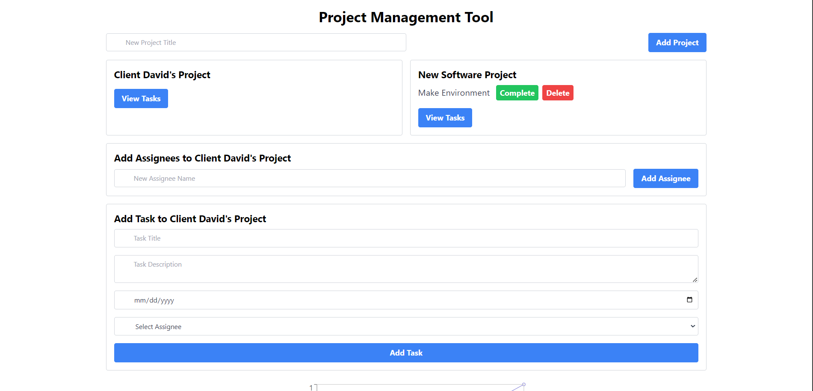

# Project Management Tool

This is a responsive Project Management Tool that allows you to manage projects, add tasks, assign assignees, and track the progress of your projects in an intuitive and user-friendly interface.



## Features

- Add and manage multiple projects.
- Assign tasks to specific assignees.
- Mark tasks as completed.
- Visualize task progress with a line chart.
- Fully responsive design.

## Developed By

**Sudesh Maduwanta**

## Prerequisites

Before you begin, ensure you have met the following requirements:

- Node.js (version 14.x or higher)
- npm or yarn

## Installation

1. Clone this repository to your local machine:

   ```bash
   git clone https://github.com/sudeshmaduawntha/project-management-tool.git

2. Navigate to the project directory:
bash
    cd project-management-tool

3. Install the necessary dependencies:
Using npm:
    npm install

# Run this project
    npm run dev

    
